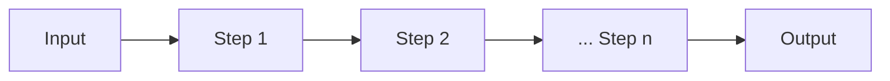
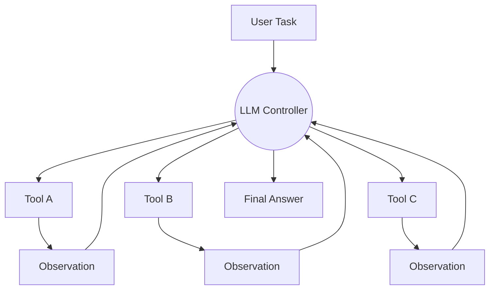
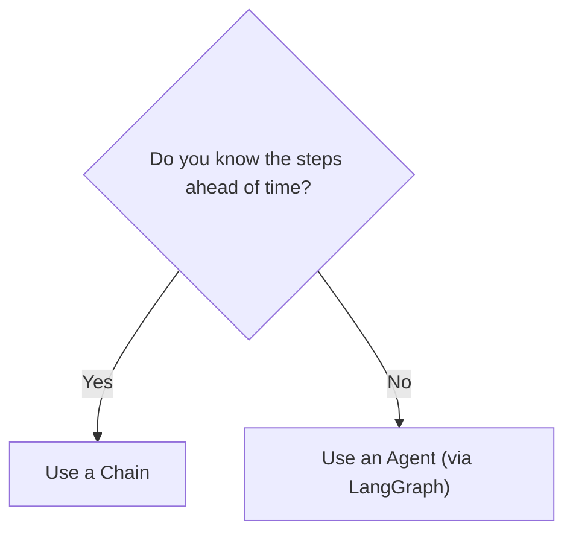
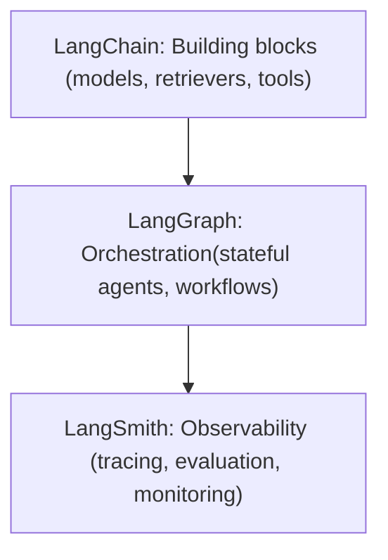

# Chains vs. Agents in LangChain

!!! info "About this case study"
    This is *not* official LangChain documentation.  
    
    This is a demonstration sample created for my portfolio.  
    It explains a core LangChain concept — **Chains vs. Agents** — in a clear, approachable way.  
    
    Claims and definitions are aligned to the latest LangChain & LangGraph docs (v0.2).  
    [LangChain Introduction](https://python.langchain.com/docs/introduction/) | [Concepts: Agents](https://python.langchain.com/docs/concepts/agents/) | [LangGraph: Why LangGraph](https://langchain-ai.github.io/langgraph/concepts/why-langgraph/) | [LangSmith Docs](https://docs.langchain.com/langsmith/home)

## Welcome: Why You Should Care

If you’re new to LangChain, you’ve probably run into two terms right away: **Chain** and **Agent**. 
Both are central concepts, and both are powerful — but they serve different purposes.

Why does this matter? 

- Using a Chain where you actually need an Agent can leave you with workflows that feel rigid and difficult to adapt.  
- Using an Agent where a Chain would suffice can lead to unnecessary overhead: slower runs, higher API costs, and trickier debugging.  

Developers often encounter these pain points firsthand:  

- Chains that break because they can’t handle a new condition.  
- Agents that wander off-course, loop endlessly, or generate a surprising number of tool calls.  

This guide gives you the mental model you need — no prior LangChain experience required. 
By the end, you’ll understand:

- What a **Chain** is (and why it’s like following a recipe).  
- What an **Agent** is (and why it’s like a chef improvising in the kitchen).  
- How to decide between them for your project.  
- Common pitfalls and best practices.  
- How they fit into the broader LangChain ecosystem: **LangGraph** (for controllable, stateful agents and workflows) and **LangSmith** (for tracing, evaluating, and monitoring).

In the sections that follow, we’ll compare Chains and Agents side by side, highlight use cases, share diagrams, and show how these concepts connect to the modern LangChain stack.

## Chains vs. Agents: Picture It

Before diving into details, here’s the high-level contrast. 
Chains and Agents are both ways of structuring work with an LLM — but they think differently about control.

**Figure 1:** A Chain is a fixed pipeline. 

Input flows through predefined steps you design in advance, producing a predictable output.

**Figure 2:** An Agent is an improviser. 

The LLM chooses tools at runtime, reasons over observations, and iterates until it can deliver an answer.

## Chains: The “Recipe” Approach

### What it feels like

- You wire together components (prompting, retrieval, parsing, post-processing).  
- The flow is predictable and repeatable (easier to debug, easier to test).  
- Ideal for **document pipelines**, **summarization**, and **data transforms**.  

**Realistic use case:**  

A support team wants daily digests of customer tickets. 
A Chain can summarize each ticket, extract key issues, and compile them into a single report.

!!! tip "When to use Chains"
    Use a Chain when your steps are **known in advance** and you want **predictability**.  
    Think repeatable workflows: ETL, summarization, and document processing.

## Agents: The “Improviser”

An **Agent** is a system that uses an LLM to decide *what to do next*. 
Instead of you hard-coding each step, the model chooses which tools or actions to run at runtime based on the task and observed tool outputs.

### What it feels like

- You define **tools** (web search, math, database lookups, APIs).  
- The LLM is the **controller** that decides which tool to use, in what order.  
- Ideal for **interactive research assistants**, **multi-tool orchestration**, or **tasks where the path isn’t clear upfront**.  

**Realistic use case:**  

A research assistant that decides when to search the web, when to use a calculator, and when to summarize findings — depending on the query.

**Modern guidance:**  

LangChain explicitly recommends building agents with **LangGraph** for control, reliability, and production readiness. 
Legacy `AgentExecutor` is being phased out.

!!! warning "When to use Agents"
    Use an Agent when you need **dynamic tool use** and the steps can’t be pre-defined.  
    Expect more variability and overhead, and plan on adding **observability** (LangSmith) and **guardrails**.

## Side-by-Side: Chains vs. Agents

| Aspect           | Chains (Recipe)                                  | Agents (Improviser)                                        |
|------------------|--------------------------------------------------|------------------------------------------------------------|
| Flow             | Fixed, pre-defined sequence                      | Dynamic; LLM chooses tools/steps at runtime                |
| Predictability   | High (repeatable, testable)                      | Lower (varies with inputs, tool outcomes, model decisions) |
| Use cases        | Summarization pipelines, ETL/data transforms     | Research assistants, tool orchestration, conditional flows |
| Debugging        | Easier: clear steps                              | Harder: LLM’s choices + external tools                     |
| Performance/Cost | Lower latency, more efficient                    | Higher overhead, longer latency                            |

## Decision Helper

**Figure 3:** If you know the steps ahead of time, use a Chain.

If not, use an Agent — and for production, build it with LangGraph for controllability and persistence.

## Common Pitfalls

| Paradigm | Pitfall                                    | Fix                                                                 |
|----------|--------------------------------------------|---------------------------------------------------------------------|
| Chains   | Brittle if a step expects perfectly formatted input | Validate and normalize inputs early; keep steps small and composable |
| Agents   | LLM chooses the wrong tool or loops        | Limit toolset initially, set iteration/time limits, and add observability |

**Comfort check:**  

It’s normal if your first Agent feels chaotic. 
Start small, grow toolsets gradually, and trace runs to understand decisions.

## Best Practices

- **Start simple:** Begin with Chains; graduate to Agents only when necessary.  
- **Keep it modular:** Break big tasks into smaller Chains, then combine.  
- **Limit toolsets:** The fewer tools an Agent can choose from, the more reliable it is.  
- **Trace everything:** Use LangSmith to see what’s happening under the hood.  
- **Plan for control:** Use LangGraph to structure Agents for production.  

## Where Chains & Agents Fit in the LangChain Ecosystem

- **LangChain** gives you the components and mental model.  
- **LangGraph** is the recommended framework for building controllable, stateful agents and workflows.  
- **LangSmith** is the observability + evaluation layer to trace, measure, and ship with confidence.  

Together, they form the modern LangChain stack: **build, orchestrate, observe**.

## Wrap-Up & Next Steps

You now have the mental model:

- **Chains** = the predictable recipe.  
- **Agents** = the improviser that picks tools dynamically (best built with **LangGraph** today).  

**Try this yourself:**

1. Build a Chain that summarizes a paragraph and extracts two facts.  
1. Build an Agent that can either search the web or do simple math. 
   Trace the run in LangSmith to watch its decisions.  

By now, Chains vs. Agents should feel less like jargon and more like **clear tools in your kit**. 
You’re ready to choose the right one with confidence—and you’ve got the ecosystem pieces (LangGraph + LangSmith) to grow from demo to production.

👏 That’s it! You’re ready to put Chains and Agents to work.

## Resources

- [LangChain Introduction](https://python.langchain.com/docs/introduction/)  
- [Concepts: Agents](https://python.langchain.com/docs/concepts/agents/)   
- [LangGraph: Why LangGraph](https://langchain-ai.github.io/langgraph/concepts/why-langgraph/)  
- [LangSmith Documentation](https://docs.langchain.com/langsmith/home)  
- [LangChain Blog](https://blog.langchain.com/)  
- [LangChain Academy](https://academy.langchain.com/)  
- [LangChain Resources](https://www.langchain.com/resources)  
